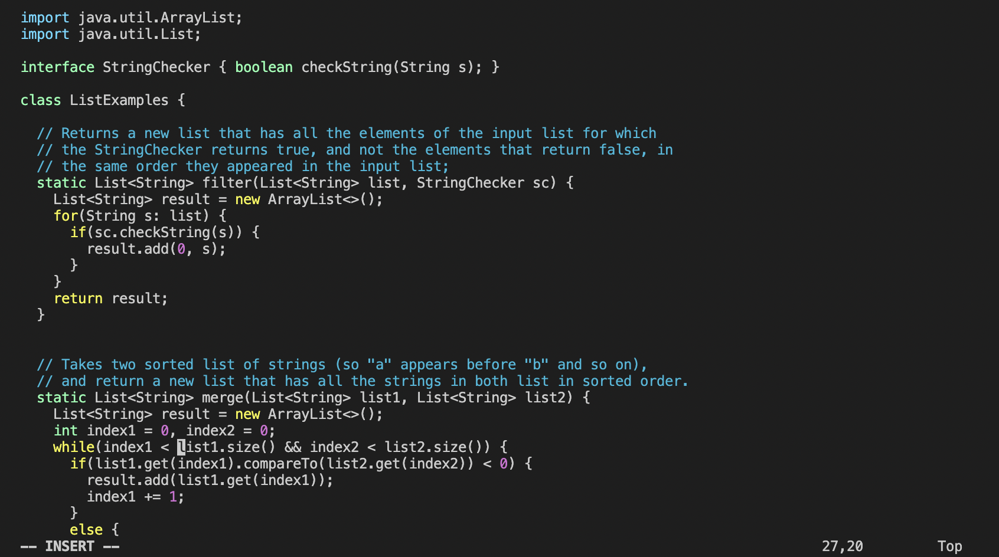
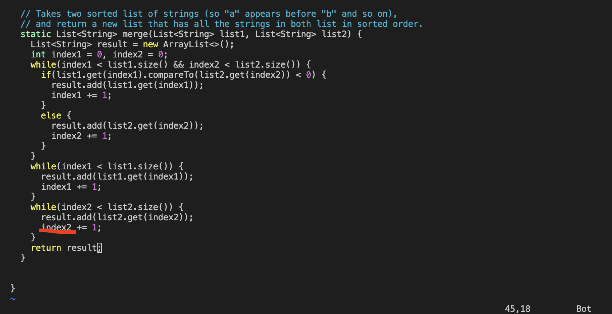

# Lab Report 4
## Competition

### Step 4. Log into ieng6:
We should type `ssh cs15lwi23ahl@ieng6.ucsd.edu` and `<enter>`in terminal to do the remote connection with my specific account
   

### Step 5. Clone your fork of the repository from your Github account:
Now, we need to make a fork of the repository [lab7 repository](https://github.com/ucsd-cse15l-w23/lab7)

After clicking on the website, we need to click `Code` and click `SSH` and copy the content of SSH
   
Now, we should type `git clone git@github.com:garys404/lab7.git` and `<enter>` in our terminal
   

### Step 6. Run the tests, demonstrating that they fail:
After that, we should enter the lab7 respository by using `cd lab7`and `<enter>`
When entering lab7, we can use `ls` and `<enter>`to find what files the lab7 has.
Now, we can run our test. First, we need to complie `javac -cp .:lib/hamcrest-core-1.3.jar:lib/junit-4.13.2.jar *.java` and `<enter>`
Next, we need to run `java -cp .:lib/hamcrest-core-1.3.jar:lib/junit-4.13.2.jar org.junit.runner.JUnitCore ListExamplesTests` and `<enter>`
   
So the we find there was 1 failture:
   
   
### Step 7. Edit the code file to fix the failing test:
So now, we want to edit the code and fix it. We type `vim ListExamples.java` and `<enter>` to use vim editor to open `ListExamples.java`.
   
Now, we can see the details of `ListExamples.java`. And We press `i` to open the insert mode. so we can change it.
   
So we need to find what mistakes the file make. We can find a clear mistake. When the file compare `index2` and `list2.size()`, it should relate to `index2`, and doesn't relate to `index1`. So we should change `index1` to `index2` 
Before fixing:
   
After fixing:
   
Now we need to press `esc` in our keyboard to exit the insert mode, and type `:wq` and `<enter>`in terminal to reserve and exit out `ListExamples.java`
   

### Step 8. Run the tests, demonstrating that they now succeed:
* Now we need to rerun the tests, so we press `<up><up><up>` to find `javac -cp .:lib/hamcrest-core-1.3.jar:lib/junit-4.13.2.jar *.java` and press `<enter>`

* After that, we should press `<up><up><up>` to find `java -cp .:lib/hamcrest-core-1.3.jar:lib/junit-4.13.2.jar org.junit.runner.JUnitCore ListExamplesTests` and press `<enter>`.

* Finally we find that the bugs are fixed.
   

### Step 9. Commit and push the resulting change to your Github account (you can pick any commit message!):
Now we need to type `git add *` and `<enter>` to make all the changes in the directory get ready to push.
Next, we type `git commit -m "Bugs fixed"` and `<enter>` to commit all the changes, and comment it to "Bugs fixed" to show what I fixed it.
   
Finally, we type `git push` and `<enter>` so we upload our files into my github account.
   
Now we can find the change in my github account !
   

l
**That is all for the report!

